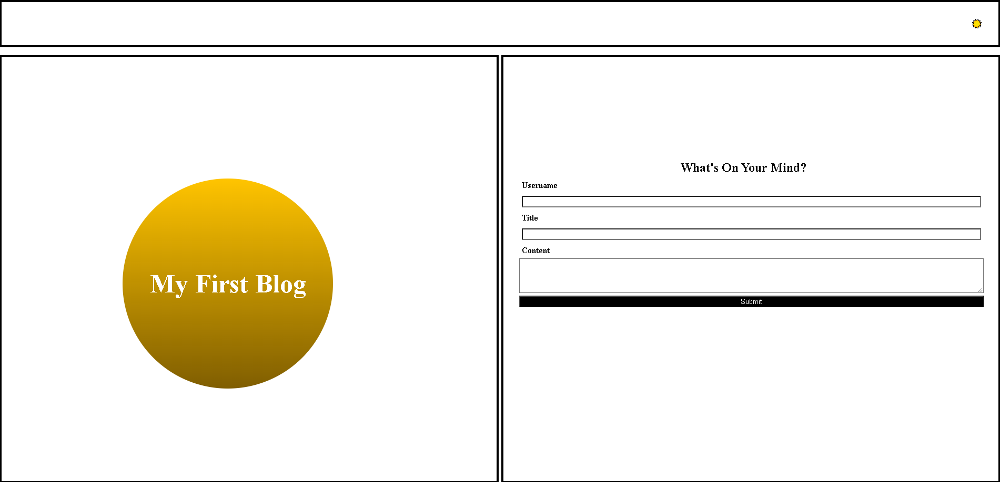
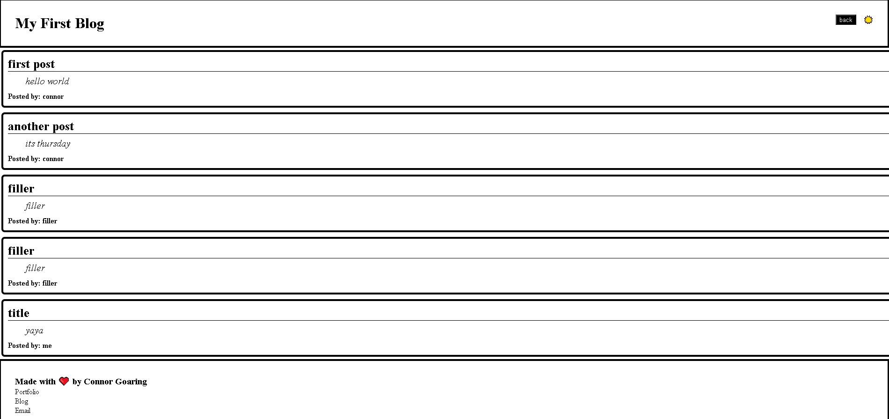

# module-4-challenge

This challenge was to  create a blog that can store values between pages and also has a functioning light and dark mode that stores itself between pages.
I spent a lot of extra time on this challenge planning it out myself rather than using the speedrun given by my instructor for the purpose of finding my 
own logic, and while my data storage could've been better (I use 3 arrays instead of 1 array of a form object), I'm still happy with the outcome.

I will likely come back and refactor this for that purpose.

# screenshot

# website link

https://cogoaring.github.io/module-4-challenge/
